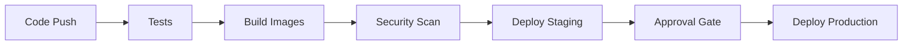

# Development Guide

This guide provides detailed information for developers working on the Task Manager project.

## 🏃‍♂️ Getting Started

### Local Development Setup

1. **Clone and Setup**
   ```bash
   git clone <repo-url>
   cd CICD
   ```

2. **Backend Development**
   ```bash
   cd backend
   python -m venv venv
   source venv/bin/activate  # Windows: venv\Scripts\activate
   pip install -r requirements.txt
   python app.py
   ```

3. **Frontend Development**
   ```bash
   cd frontend
   npm install
   npm start
   ```

## 🧪 Testing Strategy

### Backend Testing
- **Unit Tests**: Test individual functions and endpoints
- **Integration Tests**: Test API endpoints with database
- **Coverage Target**: Minimum 80%

### Frontend Testing
- **Component Tests**: Test React components in isolation
- **Integration Tests**: Test user workflows
- **E2E Tests**: Full application workflow testing

## 🔄 CI/CD Workflow

### Branch Strategy
```
main (production)
├── develop (staging)
├── feature/feature-name
├── hotfix/fix-name
└── release/version-number
```

### Pull Request Process
1. Create feature branch from `develop`
2. Make changes and add tests
3. Run local tests and quality checks
4. Create PR to `develop`
5. Automated checks run
6. Code review required
7. Merge after approval

### Quality Gates
- All tests must pass
- Code coverage ≥ 80%
- No security vulnerabilities
- Code review approval
- No merge conflicts

## 🏗️ Architecture Decisions

### Backend Architecture
- **Framework**: Flask (lightweight and flexible)
- **Database**: In-memory (for demo), easily extendable to PostgreSQL/MongoDB
- **API Design**: RESTful endpoints with clear resource naming
- **Error Handling**: Consistent error responses with proper HTTP status codes

### Frontend Architecture
- **Framework**: React with functional components and hooks
- **State Management**: Built-in useState (can be extended with Redux/Context)
- **Styling**: CSS modules for component-scoped styles
- **API Integration**: Axios for HTTP requests with proper error handling

### Docker Strategy
- **Multi-stage builds** for optimized production images
- **Development volumes** for hot-reloading
- **Health checks** for container monitoring
- **Security**: Non-root user, minimal base images

## 📦 Deployment Pipeline

### Environments
1. **Development**: Local developer machines
2. **Staging**: Automated deployment from `main` branch
3. **Production**: Manual approval required

### Deployment Process


## 🔒 Security Considerations

### Code Security
- Input validation on all endpoints
- CORS properly configured
- No sensitive data in logs
- Environment variables for configuration

### Container Security
- Non-root user in containers
- Minimal base images
- Regular vulnerability scanning
- Secrets management

### CI/CD Security
- Branch protection rules
- Required status checks
- Signed commits (optional)
- Dependency vulnerability scanning

## 📊 Monitoring & Observability

### Logging Strategy
- Structured logging with JSON format
- Log levels: DEBUG, INFO, WARN, ERROR
- Request/response logging
- Error tracking with stack traces

### Health Checks
- Application health endpoints
- Database connection health
- External service dependencies
- Container-level health checks

## 🛠️ Development Tools

### Backend Tools
- **Code Formatting**: Black
- **Import Sorting**: isort
- **Linting**: Flake8
- **Security**: Bandit
- **Testing**: pytest

### Frontend Tools
- **Code Formatting**: Prettier
- **Linting**: ESLint
- **Testing**: Jest + React Testing Library
- **Build**: Create React App

### IDE Configuration
Recommended VS Code extensions:
- Python
- Python Docstring Generator
- ES7+ React/Redux/React-Native snippets
- Prettier - Code formatter
- Docker
- GitHub Actions

## 🐛 Debugging

### Backend Debugging
```bash
# Enable debug mode
export FLASK_ENV=development
python app.py

# Run with pdb
python -m pdb app.py

# Docker debugging
docker-compose up backend
docker exec -it task-manager-backend bash
```

### Frontend Debugging
```bash
# Enable source maps
npm start

# Debug in browser
# Open Chrome DevTools -> Sources tab

# Debug tests
npm test -- --no-watch --verbose
```

### Docker Debugging
```bash
# View logs
docker-compose logs -f backend
docker-compose logs -f frontend

# Access container shell
docker exec -it <container-name> bash

# Inspect container
docker inspect <container-name>
```

## 📈 Performance Optimization

### Backend Performance
- Use connection pooling for databases
- Implement caching for frequently accessed data
- Optimize database queries
- Use pagination for large datasets

### Frontend Performance
- Lazy loading for routes
- Component memoization with React.memo
- Image optimization
- Bundle size analysis with webpack-bundle-analyzer

### Container Performance
- Multi-stage builds to reduce image size
- .dockerignore to exclude unnecessary files
- Health checks with appropriate intervals
- Resource limits for containers

## 🔧 Configuration Management

### Environment Variables
```bash
# Backend (.env)
FLASK_ENV=development
PORT=5000
DATABASE_URL=postgresql://...

# Frontend (.env)
REACT_APP_API_URL=http://localhost:5000
REACT_APP_ENV=development
```

### Docker Configuration
```yaml
# Development
version: '3.8'
services:
  backend:
    build: ./backend
    volumes:
      - ./backend:/app  # Hot reload
    environment:
      - FLASK_ENV=development

# Production
services:
  backend:
    image: backend:latest  # Pre-built image
    restart: unless-stopped
    environment:
      - FLASK_ENV=production
```

## 🚀 Future Enhancements

### Planned Features
- [ ] User authentication and authorization
- [ ] Real database integration (PostgreSQL)
- [ ] API rate limiting
- [ ] WebSocket support for real-time updates
- [ ] File upload functionality
- [ ] Email notifications
- [ ] Advanced search and filtering

### Infrastructure Improvements
- [ ] Kubernetes deployment manifests
- [ ] Monitoring with Prometheus/Grafana
- [ ] Centralized logging with ELK stack
- [ ] CDN integration for static assets
- [ ] Load balancer configuration
- [ ] Auto-scaling based on metrics

### CI/CD Enhancements
- [ ] Automated rollback on failures
- [ ] Blue-green deployment strategy
- [ ] Performance testing in pipeline
- [ ] Chaos engineering tests
- [ ] Multi-region deployments

## 📚 Learning Resources

### Flask & Python
- [Flask Documentation](https://flask.palletsprojects.com/)
- [Python Testing 101](https://realpython.com/python-testing/)
- [REST API Design](https://restfulapi.net/)

### React & JavaScript
- [React Documentation](https://react.dev/)
- [JavaScript Testing Best Practices](https://github.com/goldbergyoni/javascript-testing-best-practices)
- [React Testing Library](https://testing-library.com/docs/react-testing-library/intro/)

### Docker & DevOps
- [Docker Best Practices](https://docs.docker.com/develop/dev-best-practices/)
- [GitHub Actions Documentation](https://docs.github.com/en/actions)
- [CI/CD Best Practices](https://docs.github.com/en/actions/guides/about-continuous-integration)

### Security
- [OWASP Top 10](https://owasp.org/www-project-top-ten/)
- [Container Security](https://kubernetes.io/docs/concepts/security/)
- [Secure Coding Practices](https://owasp.org/www-project-secure-coding-practices-quick-reference-guide/)

---

Happy coding! 🎉